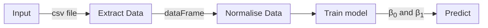
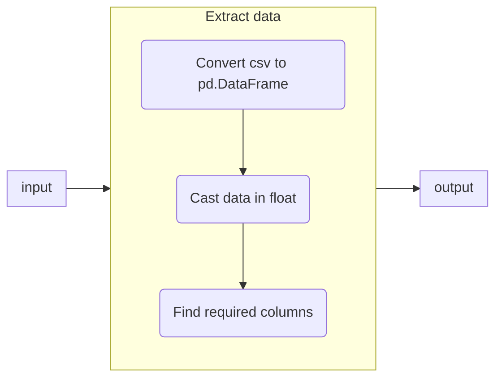
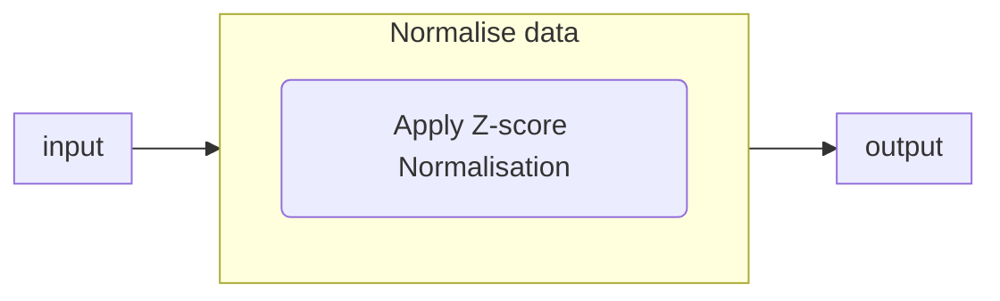

# linear_regression

---

This project lets you learn who to implement a linear regression to predict \
the price of a car  based on its mileage.

---
### Logical structure

this schema presents the steps to predict a value with data.

---
### Extract Data


---
### Normalise Data


Z-score normalisation, also known as standardisation, is a method used to scale \
the values in a dataset so that they have $\mu = 0$ and $\sigma = 1$. \
This transformation makes it possible to compare data on different scales. \

we use :

```math
x^{}_{norm} = {x - \mu^{}_{x} \over \sigma^{}_{x}}
```
where:
*   $\mu^{}_{x}$ is the x set mean.
*   $\sigma^{}_{x}$  is the x set standard deviation.
