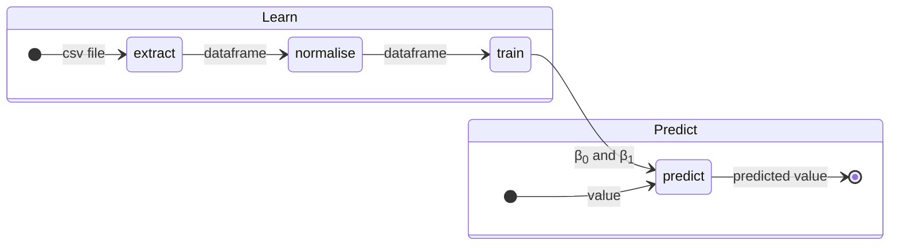
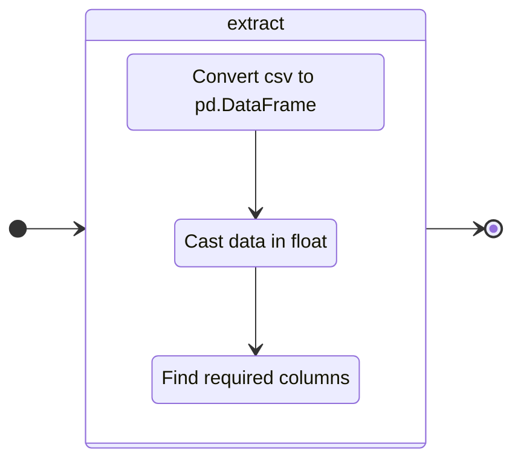
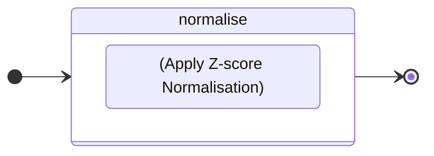
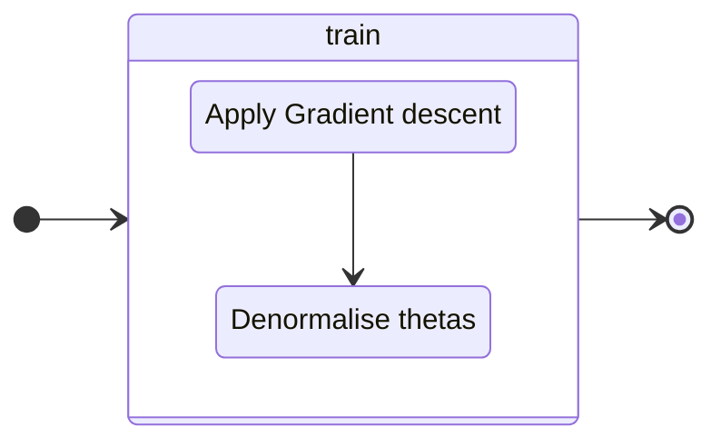

# linear_regression

---

This project lets you learn who to implement a linear regression to predict 
the price of a car  based on its mileage.

---
### Logical structure

this schema presents the steps to predict a value with data.

---
### Extract Data


---
### Normalise Data


Z-score normalisation, also known as standardisation, is a method used to scale 
the values in a dataset so that they have $\mu = 0$ and $\sigma = 1$.
This transformation makes it possible to compare data on different scales.

for X, a list of value, we use :

```math
x^{}_{norm} = {x - \mu^{}_{X} \over \sigma^{}_{X}}
```
where:
*   $\mu^{}_{X}$ is the X mean.
*   $\sigma^{}_{X}$  is the X standard deviation.

---
### Train model

#### Gradient descent

Gradient descent is an optimisation method commonly used to adjust the coefficients
of a linear regression model in order to minimise a cost function.

```python
def gradientDescent(data, learningRate, epoch):
    theta0, theta1 = 0, 0 # init thetas
    
    for i in range(epoch): # loop {epoch} time
        _g0 = computeGradient0(data, learningRate, theta0, theta1)
        _g1 = computeGradient1(data, learningRate, theta0, theta1)
        theta0 -= _g0
        theta1 -= _g1
    
    return theta0, theta1 # return thetas

```

computeGradient0 :
```math
    \theta^{}_{0(tmp)} = lr * {1 \over m} * \sum_{i=0}^{m - 1} (estimatePrice(x^{(i)}) − y^{(i)})
```
computeGradient1 :
```math
    \theta^{}_{1(tmp)} =  lr * {1 \over m}  * \sum_{i=0}^{m - 1} (estimatePrice(x^{(i)}) − y^{(i)}) ∗ x^{(i)}
```
Where:
* $lr$ is the learningRate.
* $m$ is the total number of x.
* $estimatePrice()$ the function  $` y^{}_{estimated} = θ^{}_{0} + x * θ^{}_{1} `$

#### denormalise thetas
As thetas are calculated using standardised data, we have to denormalise them to make them match the original data.

Bien sûr, voici une démonstration détaillée pour obtenir les équations de dénormalisation des coefficients $`\theta_0`$ et $`\theta_1`$.

### Équations Normalisées

1. **Données normalisées :**
   $$x_{\text{norm}} = \frac{x - \mu_x}{\sigma_x}$$
   $$y_{\text{norm}} = \frac{y - \mu_y}{\sigma_y}$$

2. **Régression linéaire sur les données normalisées :**
   $$y_{\text{norm}} = \theta_0 + \theta_1 \cdot x_{\text{norm}}$$

### Passer de $`y_{\text{norm}}`$ à $`y`$

Pour retrouver $`y`$ à partir de $`y_{\text{norm}}`$, on utilise la relation inverse de la normalisation :
   $$y = y_{\text{norm}} \cdot \sigma_y + \mu_y$$

Substituons $`y_{\text{norm}}`$ de l'équation normalisée :
   $$y = (\theta_0 + \theta_1 \cdot x_{\text{norm}}) \cdot \sigma_y + \mu_y$$

### Passer de $`x_{\text{norm}}`$ à $`x`$

Pour $`x_{\text{norm}}`$, on utilise aussi la relation inverse de la normalisation :
   $$x_{\text{norm}} = \frac{x - \mu_x}{\sigma_x} \implies x = x_{\text{norm}} \cdot \sigma_x + \mu_x$$

Substituons $`x_{\text{norm}}`$ dans l'équation du modèle :
   $$y = \left( \theta_0 + \theta_1 \cdot \frac{x - \mu_x}{\sigma_x} \right) \cdot \sigma_y + \mu_y$$

### Simplification

Développons l'équation :
   $$y = \left( \theta_0 \cdot \sigma_y + \theta_1 \cdot \frac{\sigma_y}{\sigma_x} \cdot (x - \mu_x) \right) + \mu_y$$

Réorganisons l'équation pour isoler les termes constants et ceux en fonction de $`x`$ :
   $$y = \theta_0 \cdot \sigma_y + \mu_y + \theta_1 \cdot \frac{\sigma_y}{\sigma_x} \cdot x - \theta_1 \cdot \frac{\sigma_y}{\sigma_x} \cdot \mu_x$$

Regroupons les termes constants :
   $$y = \left( \theta_0 \cdot \sigma_y + \mu_y - \theta_1 \cdot \frac{\sigma_y \cdot \mu_x}{\sigma_x} \right) + \theta_1 \cdot \frac{\sigma_y}{\sigma_x} \cdot x$$

### Identification des coefficients dénormalisés

En comparant cette équation avec la forme standard $`y = \beta_0 + \beta_1 \cdot x$`, nous pouvons identifier :
   $$\beta_1 = \theta_1 \cdot \frac{\sigma_y}{\sigma_x}$$
   $$\beta_0 = \theta_0 \cdot \sigma_y + \mu_y - \theta_1 \cdot \frac{\sigma_y \cdot \mu_x}{\sigma_x}$$

### Conclusion

Ainsi, nous obtenons les équations de dénormalisation des coefficients de la régression linéaire :
   $$\beta_1 = \theta_1 \cdot \frac{\sigma_y}{\sigma_x}$$
   $$\beta_0 = \mu_y + \sigma_y \cdot (\theta_0 - \theta_1 \cdot \frac{\mu_x}{\sigma_x})$$

Cette démonstration montre comment transformer les coefficients $`\theta_0`$ et $`\theta_1\`$ obtenus sur des données normalisées en coefficients $`\beta_0\`$ et $`\beta_1\`$ applicables aux données d'origine.
