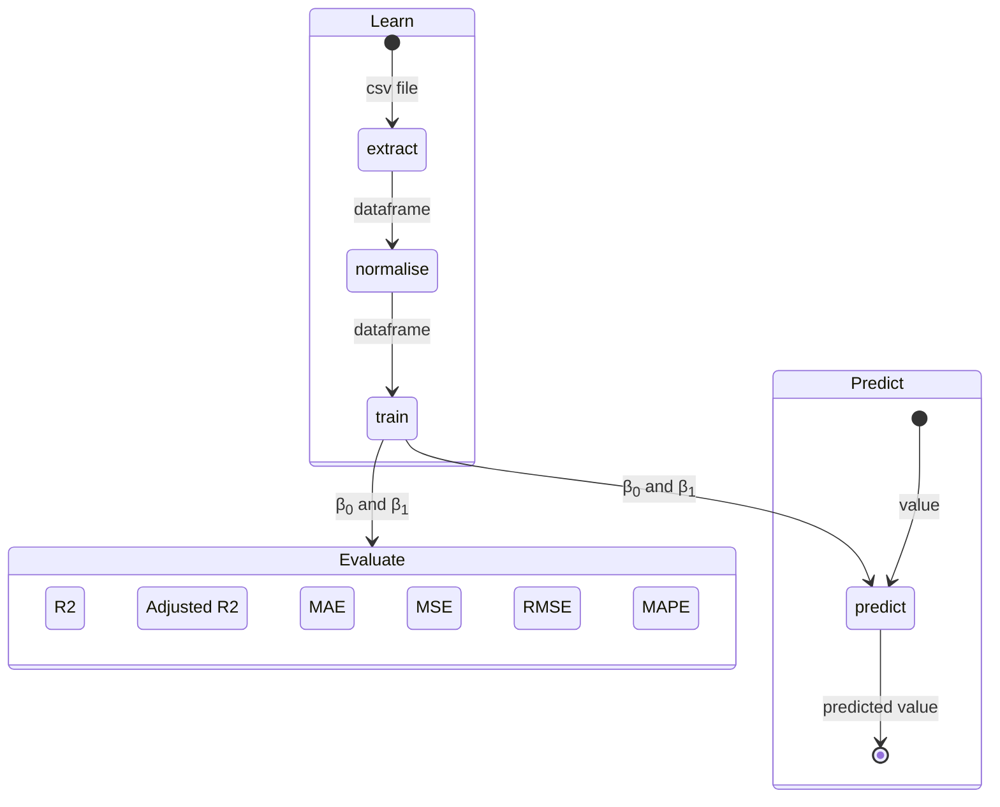
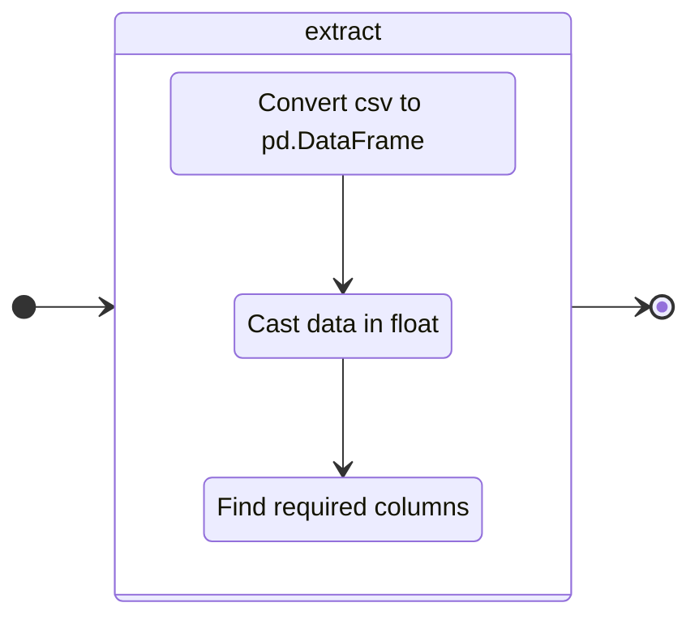
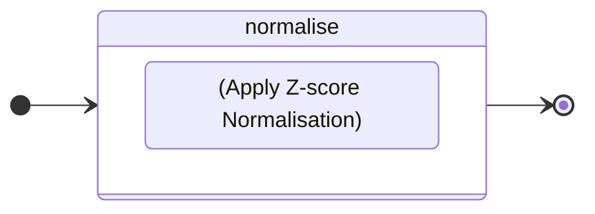
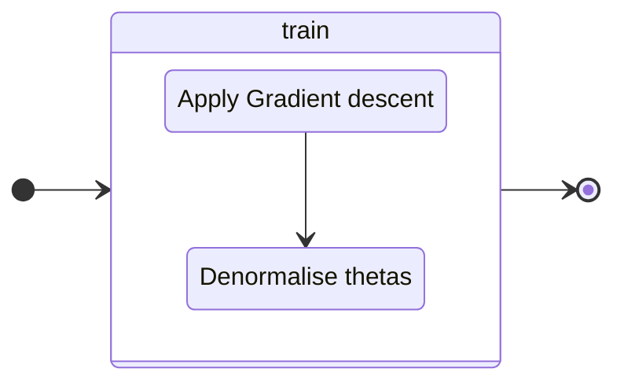
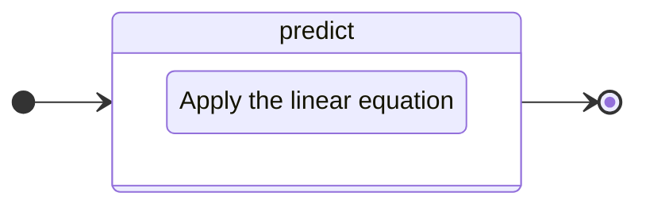
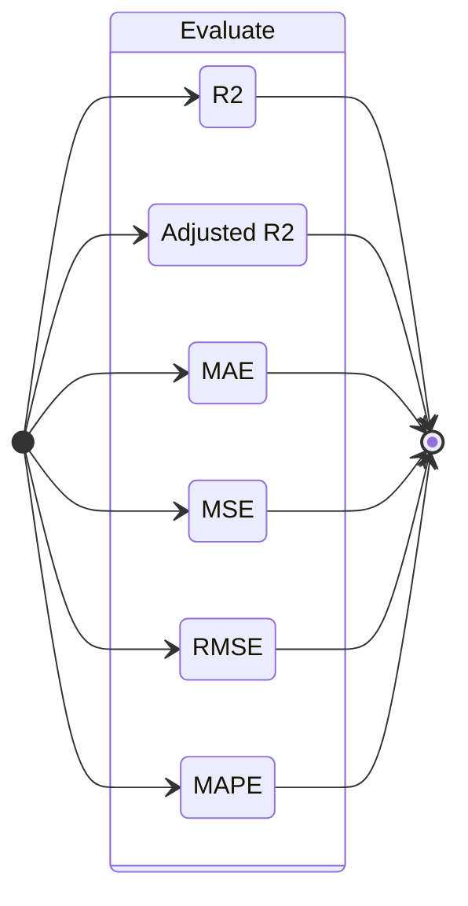

# linear_regression

---

This project lets you learn who to implement a linear regression to predict 
the price of a car  based on its mileage.

---
### Logical structure

this schema presents the steps to predict a value with data.

---
### Extract Data


---
### Normalise Data


Z-score normalisation, also known as standardisation, is a method used to scale 
the values in a dataset so that they have $\mu = 0$ and $\sigma = 1$.
This transformation makes it possible to compare data on different scales.

for X, a list of value, we use :

```math
x^{}_{norm} = {x - \mu^{}_{X} \over \sigma^{}_{X}}
```
where:
*   $\mu^{}_{X}$ is the X mean.
*   $\sigma^{}_{X}$  is the X standard deviation.

---
### Train model

#### Gradient descent

Gradient descent is an optimisation method commonly used to adjust the coefficients
of a linear regression model in order to minimise a cost function.
We search to minimise the log loss function:

```math
    L = {-{1 \over m} \sum^{m - 1}_{i = 0} y^{(i)} {\log(a^{(i)}) + (1 - y^{(i)}) \log(1 - a^{(i)})}}
```
with :
- $a$ the equation of prediction.
```math
    a = \theta_0 + \theta_1 * x
```
- $y$ the given result

To find the best $\theta_0$ and $\theta_1$ we want to compute, for each epoch:
```math
    \theta_0 = \theta_0(prev) - \alpha * {\partial L \over \partial \theta_0}
```
and
```math
    \theta_1 = \theta_1(prev) - \alpha * {\partial L \over \partial \theta_1}
```

where :
```math
    {\partial L \over \partial \theta_0} =  {\partial L \over \partial a} *  {\partial a \over \partial \theta_0}
```
```math
    {\partial L \over \partial \theta_0} = { -{1 \over m - 1} \sum^{m -1}_{i = 0}(a^{(i)} - y^{(i)})}
```
and
```math
    {\partial L \over \partial \theta_1} = {\partial L \over \partial a} *  {\partial a \over \partial \theta_1}
```
```math
    {\partial L \over \partial \theta_1} = { -{1 \over m - 1} \sum^{m -1}_{i = 0}(a^{(i)} - y^{(i)}) * x^{(i)}}
```
In this case $\alpha$ can be associate to our learning rate.


```python
def gradientDescent(data, learning_rate, epoch):
    theta0, theta1 = 0, 0 # init thetas
    
    for i in range(epoch): # loop {epoch} time
        _g0 = compute_partial_derivative_0(data, theta0, theta1)
        _g1 = compute_partial_derivative_1(data, theta0, theta1)
        theta0 -= learning_rate * _g0
        theta1 -= learning_rate * _g1
    
    return theta0, theta1 # return thetas

```

partial_derivative_0 :
```math
    \theta^{}_{0(tmp)} = lr * {1 \over m} * \sum_{i=0}^{m - 1} (estimatePrice(x^{(i)}) − y^{(i)})
```
partial_derivative_1 :
```math
    \theta^{}_{1(tmp)} =  lr * {1 \over m}  * \sum_{i=0}^{m - 1} (estimatePrice(x^{(i)}) − y^{(i)}) ∗ x^{(i)}
```
Where:
* $lr$ is the learningRate.
* $m$ is the total number of x.
* $estimatePrice()$ the function  $` y^{}_{estimated} = θ^{}_{0} + x * θ^{}_{1} `$

#### denormalise thetas
As thetas are calculated using standardised data, we have to denormalise them to make them match the original data.

##### Standard equations

1. *Normalised data :*
   $$x_{\text{norm}} = \frac{x - \mu_x}{\sigma_x}$$
   $$y_{\text{norm}} = \frac{y - \mu_y}{\sigma_y}$$

2. *Linear regression on normalised data :*
   $$y_{\text{norm}} = \theta_0 + \theta_1 \cdot x_{\text{norm}}$$

##### From $`y_{\text{norm}}`$ to $`y`$

To find $`y`$ from $`y_{\text{norm}}`$, we use the inverse relationship of normalisation :
   $$y = y_{\text{norm}} \cdot \sigma_y + \mu_y$$

Substitute $`y_{\text{norm}}`$ for the standard equation :
   $$y = (\theta_0 + \theta_1 \cdot x_{\text{norm}}) \cdot \sigma_y + \mu_y$$

##### From $`x_{\text{norm}}`$ to $`x`$

For $`x_{\text{norm}}`$, we also use the inverse relationship of normalisation :
   $$x_{\text{norm}} = \frac{x - \mu_x}{\sigma_x} \implies x = x_{\text{norm}} \cdot \sigma_x + \mu_x$$

Substitute $`x_{\text{norm}}`$ in the model equation :
   $$y = \left( \theta_0 + \theta_1 \cdot \frac{x - \mu_x}{\sigma_x} \right) \cdot \sigma_y + \mu_y$$

##### Simplification

Let's develop the equation :
   $$y = \left( \theta_0 \cdot \sigma_y + \theta_1 \cdot \frac{\sigma_y}{\sigma_x} \cdot (x - \mu_x) \right) + \mu_y$$

Let's rearrange the equation to isolate the constant terms and those as a function of $`x`$ :
   $$y = \theta_0 \cdot \sigma_y + \mu_y + \theta_1 \cdot \frac{\sigma_y}{\sigma_x} \cdot x - \theta_1 \cdot \frac{\sigma_y}{\sigma_x} \cdot \mu_x$$

Let's group the constant terms together:
   $$y = \left( \theta_0 \cdot \sigma_y + \mu_y - \theta_1 \cdot \frac{\sigma_y \cdot \mu_x}{\sigma_x} \right) + \theta_1 \cdot \frac{\sigma_y}{\sigma_x} \cdot x$$

##### Identification of denormalised coefficients

By comparing this equation with the standard form $`y = \beta_0 + \beta_1 \cdot x`$, we can identify :
   $$\beta_1 = \theta_1 \cdot \frac{\sigma_y}{\sigma_x}$$
   $$\beta_0 = \theta_0 \cdot \sigma_y + \mu_y - \theta_1 \cdot \frac{\sigma_y \cdot \mu_x}{\sigma_x}$$

#### Conclusion

This gives us the denormalisation equations for the coefficients of the linear regression:
   $$\beta_1 = \theta_1 \cdot \frac{\sigma_y}{\sigma_x}$$
   $$\beta_0 = \mu_y + \sigma_y \cdot (\theta_0 - \theta_1 \cdot \frac{\mu_x}{\sigma_x})$$

---

### Predict


linear equation:
$$y_{predict} = \beta_0 + \beta_1 * x$$

---

### Evaluate


Performance measures are essential for assessing the quality of a linear regression model.

### 1. **R² (Determination coefficient)**
   - **Definition** : R² measures the proportion of the total variance in the data that is explained by the regression model. 
   - **Interpretation** : An R² value close to 1 indicates that the model explains the variability of the data well. For example, an R² of 0.8 means that 80% of the variance in the data is explained by the model.
   - **Formula** :
```math
    R^2 = 1 - \frac{\Sigma^{n}_{i=0} (y_i - \hat{y}_i)^2}{\Sigma^{n}_{i=0} (y_i - \bar{y})^2}
```

where $` y_i `$ are the observed values, $` \hat{y}_i `$ are the predicted values, and $` \bar{y} `$ is the average of the observed values.

### 2. **MAE (Mean Absolute Error)**
   - **Definition** : MAE measures the average of the absolute errors between the observed and predicted values.
   - **Interpretation** : A lower MAE indicates a more accurate model. It gives an idea of the average error that can be expected from the model's predictions.
   - **Formula** :
     $$MAE = \frac{1}{n} \sum_{i=1}^{n} |y_i - \hat{y}_i|$$

### 3. **MSE (Mean Squared Error)**
   - **Definition** : MSE measures the mean square error between observed and predicted values.
   - **Interpretation** : As the errors are squared, larger errors are penalised more severely. A lower MSE indicates a better model.
   - **Formula** :
     $$MSE = \frac{1}{n} \sum_{i=1}^{n} (y_i - \hat{y}_i)^2$$

### 4. **RMSE (Root Mean Squared Error)**
   - **Definition** : RMSE is the square root of the mean square error.
   - **Interpretation** : RMSE gives an idea of the magnitude of the typical error. Like MSE, it penalises large errors more severely. A lower RMSE indicates a better model.
   - **Formula** :
     $$RMSE = \sqrt{\frac{1}{n} \sum_{i=1}^{n} (y_i - \hat{y}_i)^2}$$

### 5. **MAPE (Mean Absolute Percentage Error)**
   - **Definition** : MAPE measures the average absolute error as a percentage of the observed values.
   - **Interpretation** : MAPE is useful for understanding relative error as a percentage, which can be more intuitive than absolute errors.
   - **Formula** :
     $$MAPE = \frac{1}{n} \sum_{i=1}^{n} \left| \frac{y_i - \hat{y}_i}{y_i} \right| \times 100$$

### 6. **Adjusted R²**
   - **Definition** : The R² adjustment takes into account the number of predictors in the model and penalises models that are too complex.
   - **Interpretation** : It is particularly useful when comparing models with a different number of independent variables. A higher value indicates a better fitted model.
   - **Formula** :
     $$R^2_{adjusted} = 1 - \left( \frac{(1 - R^2)(n - 1)}{n - p - 1} \right)$$
     where $` n `$ is the number of observations and $` p `$ is the number of predictors.

