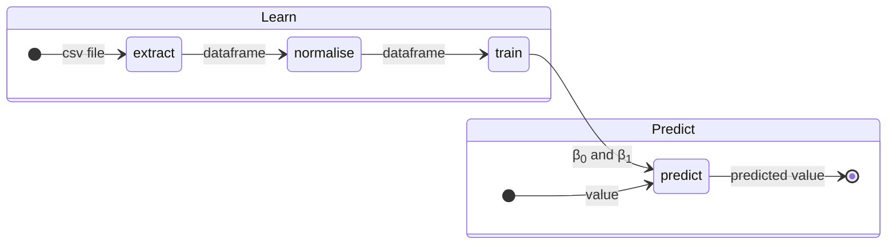
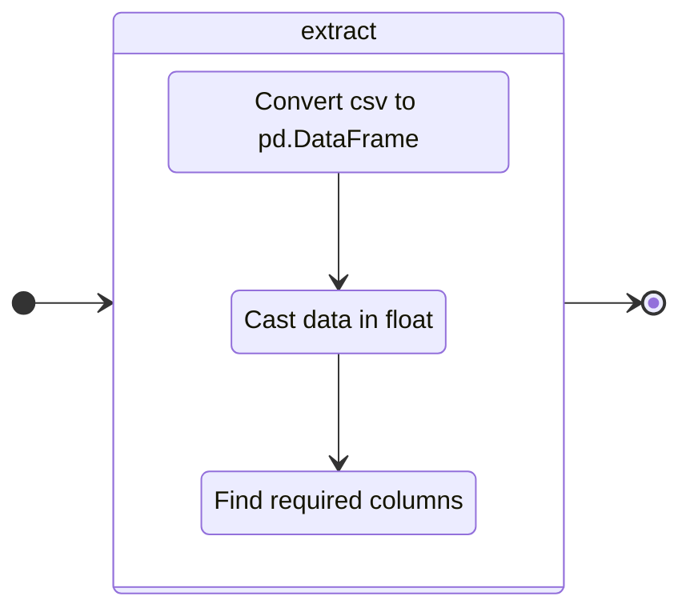
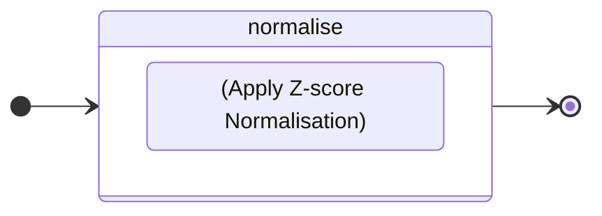
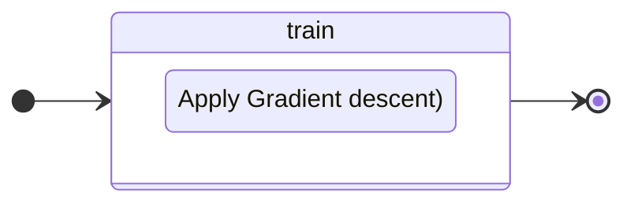

# linear_regression

---

This project lets you learn who to implement a linear regression to predict \
the price of a car  based on its mileage.

---
### Logical structure

this schema presents the steps to predict a value with data.

---
### Extract Data


---
### Normalise Data


Z-score normalisation, also known as standardisation, is a method used to scale \
the values in a dataset so that they have $\mu = 0$ and $\sigma = 1$. \
This transformation makes it possible to compare data on different scales.

for X, a list of value, we use :

```math
x^{}_{norm} = {x - \mu^{}_{X} \over \sigma^{}_{X}}
```
where:
*   $\mu^{}_{X}$ is the X mean.
*   $\sigma^{}_{X}$  is the X standard deviation.

---
### Train model


```math
    \theta^{}_{0(tmp)} = lr * {1 \over m} * \sum_{i=0}^{m - 1} (estimatePrice(x^{}_{i}) − y^{}_{i})
```
```math
    \theta^{}_{1(tmp)} =  lr * {1 \over m}  * \sum_{i=0}^{m - 1} (estimatePrice(x^{}_{i}) − y^{}_{i}) ∗ x^{}_{i}
```
