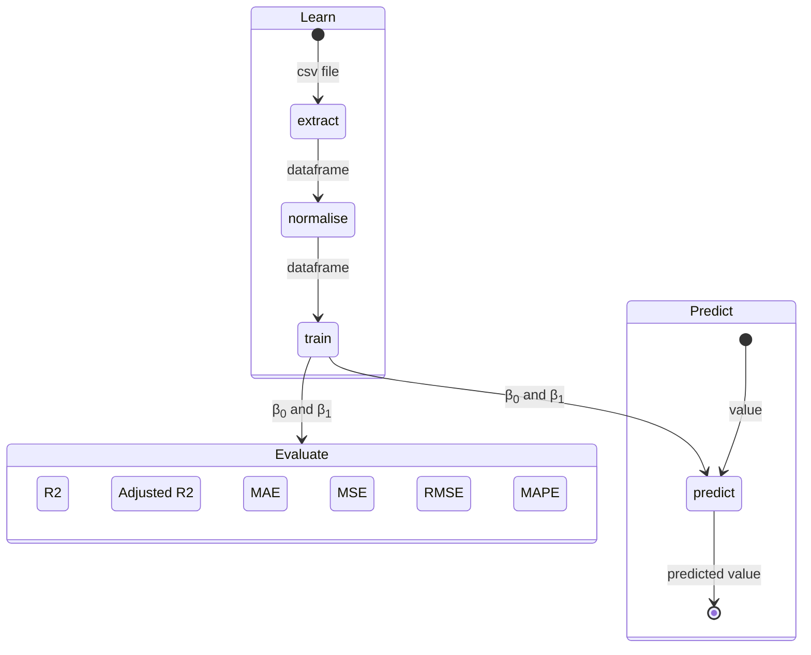
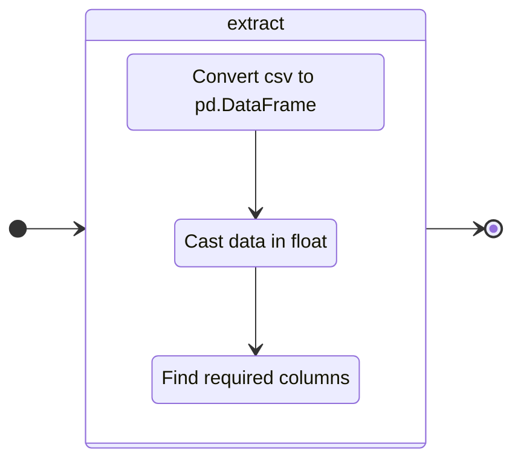
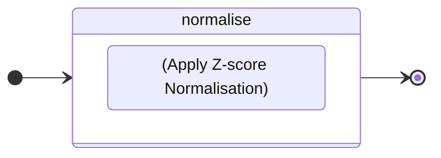
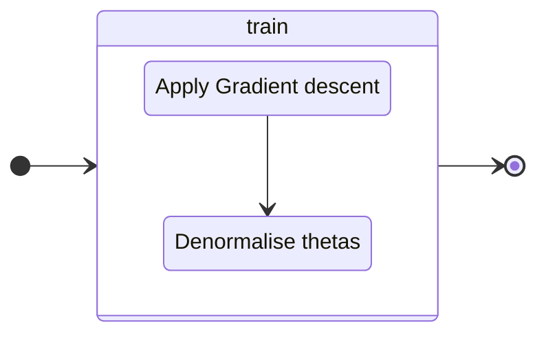
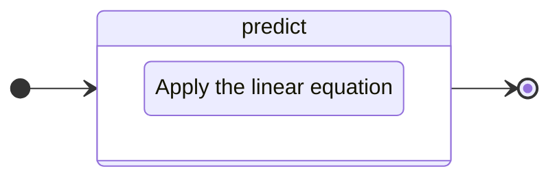
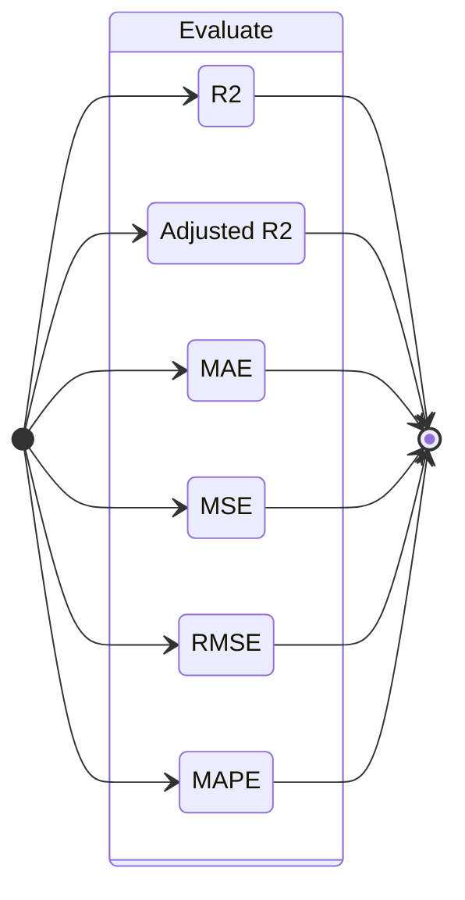

# linear_regression

---

This project lets you learn who to implement a linear regression to predict 
the price of a car  based on its mileage.

---
### Logical structure

this schema presents the steps to predict a value with data.

---
### Extract Data


---
### Normalise Data


Z-score normalisation, also known as standardisation, is a method used to scale 
the values in a dataset so that they have $\mu = 0$ and $\sigma = 1$.
This transformation makes it possible to compare data on different scales.

for X, a list of value, we use :

```math
x^{}_{norm} = {x - \mu^{}_{X} \over \sigma^{}_{X}}
```
where:
*   $\mu^{}_{X}$ is the X mean.
*   $\sigma^{}_{X}$  is the X standard deviation.

---
### Train model

#### Gradient descent

Gradient descent is an optimisation method commonly used to adjust the coefficients
of a linear regression model in order to minimise a cost function.

```python
def gradientDescent(data, learningRate, epoch):
    theta0, theta1 = 0, 0 # init thetas
    
    for i in range(epoch): # loop {epoch} time
        _g0 = computeGradient0(data, learningRate, theta0, theta1)
        _g1 = computeGradient1(data, learningRate, theta0, theta1)
        theta0 -= _g0
        theta1 -= _g1
    
    return theta0, theta1 # return thetas

```

computeGradient0 :
```math
    \theta^{}_{0(tmp)} = lr * {1 \over m} * \sum_{i=0}^{m - 1} (estimatePrice(x^{(i)}) − y^{(i)})
```
computeGradient1 :
```math
    \theta^{}_{1(tmp)} =  lr * {1 \over m}  * \sum_{i=0}^{m - 1} (estimatePrice(x^{(i)}) − y^{(i)}) ∗ x^{(i)}
```
Where:
* $lr$ is the learningRate.
* $m$ is the total number of x.
* $estimatePrice()$ the function  $` y^{}_{estimated} = θ^{}_{0} + x * θ^{}_{1} `$

#### denormalise thetas
As thetas are calculated using standardised data, we have to denormalise them to make them match the original data.

##### Standard equations

1. *Normalised data :*
   $$x_{\text{norm}} = \frac{x - \mu_x}{\sigma_x}$$
   $$y_{\text{norm}} = \frac{y - \mu_y}{\sigma_y}$$

2. *Linear regression on normalised data :*
   $$y_{\text{norm}} = \theta_0 + \theta_1 \cdot x_{\text{norm}}$$

##### From $`y_{\text{norm}}`$ to $`y`$

To find $`y`$ from $`y_{\text{norm}}`$, we use the inverse relationship of normalisation :
   $$y = y_{\text{norm}} \cdot \sigma_y + \mu_y$$

Substitute $`y_{\text{norm}}`$ for the standard equation :
   $$y = (\theta_0 + \theta_1 \cdot x_{\text{norm}}) \cdot \sigma_y + \mu_y$$

##### From $`x_{\text{norm}}`$ to $`x`$

For $`x_{\text{norm}}`$, we also use the inverse relationship of normalisation :
   $$x_{\text{norm}} = \frac{x - \mu_x}{\sigma_x} \implies x = x_{\text{norm}} \cdot \sigma_x + \mu_x$$

Substitute $`x_{\text{norm}}`$ in the model equation :
   $$y = \left( \theta_0 + \theta_1 \cdot \frac{x - \mu_x}{\sigma_x} \right) \cdot \sigma_y + \mu_y$$

##### Simplification

Let's develop the equation :
   $$y = \left( \theta_0 \cdot \sigma_y + \theta_1 \cdot \frac{\sigma_y}{\sigma_x} \cdot (x - \mu_x) \right) + \mu_y$$

Let's rearrange the equation to isolate the constant terms and those as a function of $`x`$ :
   $$y = \theta_0 \cdot \sigma_y + \mu_y + \theta_1 \cdot \frac{\sigma_y}{\sigma_x} \cdot x - \theta_1 \cdot \frac{\sigma_y}{\sigma_x} \cdot \mu_x$$

Let's group the constant terms together:
   $$y = \left( \theta_0 \cdot \sigma_y + \mu_y - \theta_1 \cdot \frac{\sigma_y \cdot \mu_x}{\sigma_x} \right) + \theta_1 \cdot \frac{\sigma_y}{\sigma_x} \cdot x$$

##### Identification of denormalised coefficients

By comparing this equation with the standard form $`y = \beta_0 + \beta_1 \cdot x`$, we can identify :
   $$\beta_1 = \theta_1 \cdot \frac{\sigma_y}{\sigma_x}$$
   $$\beta_0 = \theta_0 \cdot \sigma_y + \mu_y - \theta_1 \cdot \frac{\sigma_y \cdot \mu_x}{\sigma_x}$$

#### Conclusion

This gives us the denormalisation equations for the coefficients of the linear regression:
   $$\beta_1 = \theta_1 \cdot \frac{\sigma_y}{\sigma_x}$$
   $$\beta_0 = \mu_y + \sigma_y \cdot (\theta_0 - \theta_1 \cdot \frac{\mu_x}{\sigma_x})$$

---

### Predict


linear equation:
$$y_{predict} = \beta_0 + \beta_1 * x$$

---

### Evaluate


Les mesures de performance sont essentielles pour évaluer la qualité d'un modèle de régression linéaire.

### 1. **R² (Coefficient de Détermination)**
   - **Définition** : R² mesure la proportion de la variance totale des données qui est expliquée par le modèle de régression. 
   - **Interprétation** : Une valeur de R² proche de 1 indique que le modèle explique bien la variabilité des données. Par exemple, un R² de 0,8 signifie que 80 % de la variance des données est expliquée par le modèle.
   - **Formule** :
     $$R^2 = 1 - \frac{\sum_{i=1}^{n} (y_i - \hat{y}_i)^2}{\sum_{i=1}^{n} (y_i - \bar{y})^2}$$
     où $` y_i `$ sont les valeurs observées, $` \hat{y}_i `$ sont les valeurs prédites, et $` \bar{y} `$ est la moyenne des valeurs observées.

### 2. **MAE (Mean Absolute Error)**
   - **Définition** : MAE mesure la moyenne des erreurs absolues entre les valeurs observées et prédites.
   - **Interprétation** : Une MAE plus faible indique un modèle plus précis. Elle donne une idée de l'erreur moyenne que l'on peut attendre des prédictions du modèle.
   - **Formule** :
     $$MAE = \frac{1}{n} \sum_{i=1}^{n} |y_i - \hat{y}_i|$$

### 3. **MSE (Mean Squared Error)**
   - **Définition** : MSE mesure la moyenne des carrés des erreurs entre les valeurs observées et prédites.
   - **Interprétation** : Comme les erreurs sont élevées au carré, les erreurs plus importantes sont pénalisées plus sévèrement. Une MSE plus faible indique un meilleur modèle.
   - **Formule** :
     $$MSE = \frac{1}{n} \sum_{i=1}^{n} (y_i - \hat{y}_i)^2$$

### 4. **RMSE (Root Mean Squared Error)**
   - **Définition** : RMSE est la racine carrée de la moyenne des carrés des erreurs.
   - **Interprétation** : RMSE donne une idée de l'ampleur de l'erreur typique. Comme MSE, elle pénalise plus sévèrement les grandes erreurs. Une RMSE plus faible indique un meilleur modèle.
   - **Formule** :
     $$RMSE = \sqrt{\frac{1}{n} \sum_{i=1}^{n} (y_i - \hat{y}_i)^2}$$

### 5. **MAPE (Mean Absolute Percentage Error)**
   - **Définition** : MAPE mesure la moyenne des erreurs absolues en pourcentage des valeurs observées.
   - **Interprétation** : MAPE est utile pour comprendre l'erreur relative en pourcentage, ce qui peut être plus intuitif que les erreurs absolues.
   - **Formule** :
     $$MAPE = \frac{1}{n} \sum_{i=1}^{n} \left| \frac{y_i - \hat{y}_i}{y_i} \right| \times 100$$

### 6. **Adjusted R² (R² Ajusté)**
   - **Définition** : L'ajusté R² tient compte du nombre de prédicteurs dans le modèle et pénalise les modèles trop complexes.
   - **Interprétation** : Il est particulièrement utile lorsque vous comparez des modèles avec un nombre différent de variables indépendantes. Une valeur plus élevée indique un meilleur modèle ajusté.
   - **Formule** :
     $$R^2_{ajusté} = 1 - \left( \frac{(1 - R^2)(n - 1)}{n - p - 1} \right)$$
     où $` n `$ est le nombre d'observations et $` p `$ le nombre de prédicteurs.

En utilisant ces mesures de performance, vous pouvez obtenir une vue d'ensemble de la précision et de la fiabilité de votre modèle de régression linéaire. Chaque mesure a ses avantages et ses inconvénients, et souvent, il est utile de regarder plusieurs de ces mesures pour évaluer la performance globale de votre modèle.